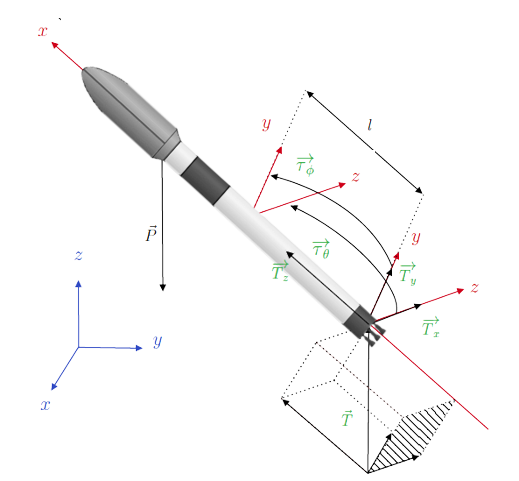

<h1 align="center">
  
</h1>

<h1 align="center">Modelagem de Sistemas Dinâmicos (2023)</h1>

Trata-se do repositório voltado para organizar os códigos desenvolvidos ao longo da disciplina, bem como os exercícios e as etapas intermediárias do projeto final, que corresponde à modelagem de um sistema complexo qualquer no domínio do tempo.

<h4 align="center"> 
	🎉 Encerrrado! 🎉
</h4>

### 📝 Pré-requisitos

Antes de começar, você vai precisar ter instalado em sua máquina as seguintes ferramentas: [Git](https://git-scm.com). Além disto é bom ter um editor para trabalhar com o código como [VSCode](https://code.visualstudio.com/)

### 🍁 Rodando as Aplicações

```bash
# Clone este repositório
$ git clone https://github.com/lucascarvalho10/pme3380

# Acesse a pasta do projeto no terminal/cmd

# Instale as dependências

# Execute a aplicação em modo de desenvolvimento
```

### ✏️ Exercícios

Todos os exercícios serão resolvidos e salvos todos neste repositório na sua pasta específica.

### 🔥 Trabalho Final

#### 🚀 Controle vetorizado de empuxo para o sistema de propulsão de pouso de um Foguete 🚀

O objetivo do trabalho é modelar o sistema de propulsão de um foguete na situação de pouso a partir da vetorização do empuxo, o chamado TVC (Thurst Vector Control).

<h3 align="center">
  
</h3>

O modelo leva em consideração um sistema de massa variável, em que a movimentação orientada do bocal do foguete permite deslocá-lo no espaço, garantindo a realização de diferentes naturezas de movimentos, incluindo aqueles necessários para o seu pouso em cenários diversos.
