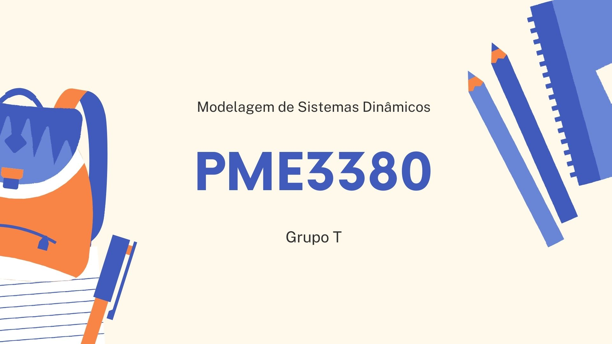

<h1 align="center">
  
</h1>

<h1 align="center">Modelagem de Sistemas Dinâmicos (2023)</h1>

Trata-se do repositório voltado para organizar os códigos desenvolvidos ao longo da disciplina, bem como os exercícios e as etapas intermediárias do projeto final, que corresponde à modelagem de um sistema complexo qualquer no domínio do tempo. 

<h4 align="center"> 
	🚧  Em desenvolvimento...  🚧
</h4>

### 📝 Pré-requisitos

Antes de começar, você vai precisar ter instalado em sua máquina as seguintes ferramentas: [Git](https://git-scm.com).  Além disto é bom ter um editor para trabalhar com o código como [VSCode](https://code.visualstudio.com/)

### 🍁 Rodando as Aplicações

```bash
# Clone este repositório
$ git clone https://github.com/lucascarvalho10/pme3380

# Acesse a pasta do projeto no terminal/cmd

# Instale as dependências

# Execute a aplicação em modo de desenvolvimento
```

### ✏️ Exercícios 

Todos os exercícios serão resolvidos e salvos todos neste repositório na sua pasta específica. 

### 🚀 Trabalho Final

Modelagem do Sistema ...

<h1 align="center">
  
</h1>
